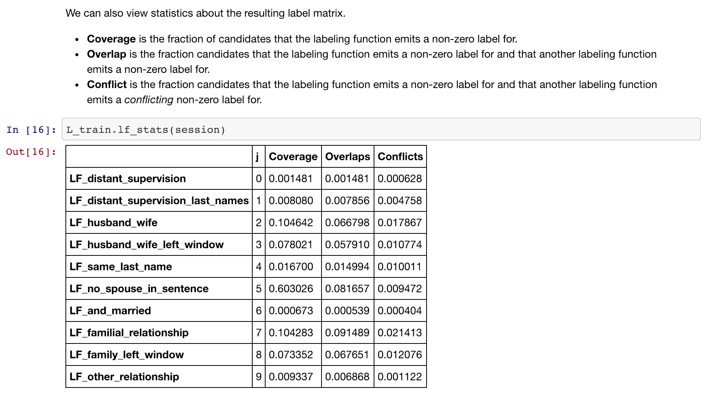
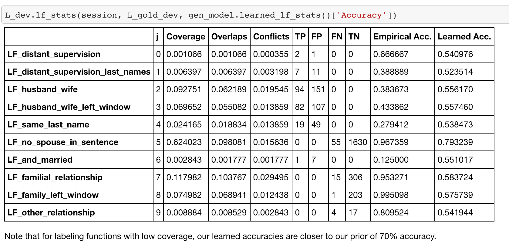
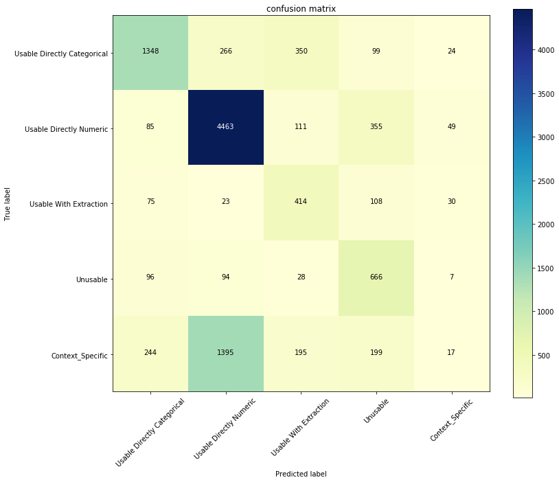
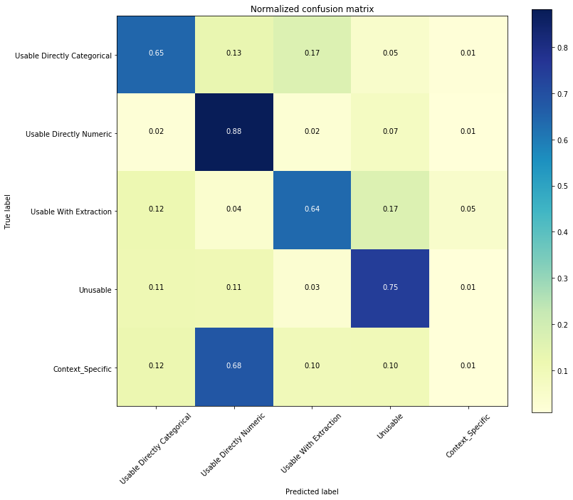
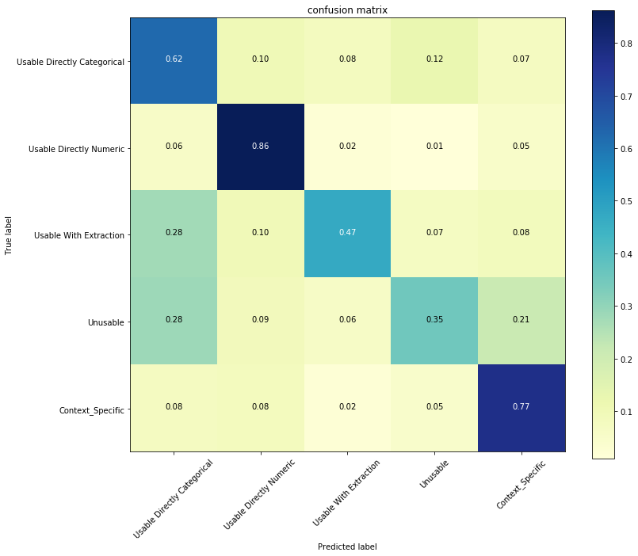

**Jingwu Xu** 

## Project:

Build a training data creation framework, say, using Snorkel for automatic ML schema extraction from data files for predicting feature type based on attribute name, sample values, and statistics. Compare with recent work on manually labeled dataset.

## Meeting:

Wednesday 1.30pm.

## Rules for assigning labels

|            Category             | Case                                                         |             |
| :-----------------------------: | :----------------------------------------------------------- | ----------- |
|   **Usable directly numeric**   | **Case a.** Should be usable directly as a number feature for ML | numeric     |
|   **Usable with extraction**    | **Case b.** A number present along with unit of measure string<br/>**Case c.** A text corpus with semantic meaning <br/>**Case d.** Date or time stamp | textual     |
| **Usable directly categorical** | **Case e.** Yes/No type values, including binary 0/1 answers <br/>**Case f.** Country names, city names, food type names, and other object type names that are not cases *l* or *m* below <br/>**Case g.** Coded numbers that are short forms of names in case *f* that are not cases *l* or *m* below <br/>**Case h.** Short names that indicate type from a known finite set/domain that are not case *l* below <br/>**Case i.** Handful of coded numbers that repeat themselves but arbitrary arithmetic on them is not meaningful and that are also not case *l* or *n* below <br/>**Case j.** A coded number that encodes real-world entities from a known finite domain set | categorical |
|          **Unusable**           | **Case k.** A number indicating the position of a record in its dataset table <br/>**Case** **l.** An attribute that is likely the primary key in its dataset table | unusable    |
|      **Context dependent**      | **Case m.** Person name, company name, or any entity name that is not generic <br/>**Case** **n.** Coded numbers or id for people, company, or other entity names from case m that are not cases g, i, j, k, or l above. | dependent   |


## Questions:

1. 

   | Record_id | y_pred                 | y_act            | Reason | y_Arun           | Check       | Attribute_name | Total_val | num of dist_val |             | Num of nans | mean        | std_dev     | min_val | max_val | sample_1        | sample_2        | sample_3        | sample_4        | sample_5        |
   | --------- | ---------------------- | ---------------- | ------ | ---------------- | ----------- | -------------- | --------- | --------------- | ----------- | ----------- | ----------- | ----------- | ------- | ------- | --------------- | --------------- | --------------- | --------------- | --------------- |
   | 53        | Unusable               | Unusable         | l      | Unusable         |             | id             | 50000     | 50000           |             | 0           | 44432.4548  | 15773.45744 | 17283   | 73469   | 17283           | 17284           | 17285           | 17286           | 17287           |
   | 48        | Unusable               | Unusable         | l      | Unusable         |             | BeerID         | 73861     | 73861           |             | 0           | 36931       | 21321.83411 | 1       | 73861   | 1               | 2               | 3               | 4               | 5               |
   | 51        | Unusable               | Context_specific | n      | Context_specific | check       | animal_id      | 29421     | 28209           | 95.88049353 | 0           | 0           | 0           | 0       | 0       | A684346         | A685067         | A678580         | A675405         | A670420         |
   | 34        | Unusable               | Context_specific | l      | Context_specific |             | id             | 671205    | 671205          |             | 0           | 993248.5937 | 196611.129  | 653047  | 1340339 | 653051          | 653053          | 653068          | 653063          | 653084          |
   | 50        | Unusable               | Context_specific | m      | Context_specific | interesting | ACTOR1_ID      | 165808    | 3032            | 1.828621056 | 25061       | 2587.796692 | 1030.062165 | 1       | 3960    |                 | 1071            | 2037            | 1077            | 2191            |
   | 37        | Usable with extraction | Context_specific | n      | Context_specific | check       | Loan Theme ID  | 15736     | 718             | 4.562785968 | 0           | 0           | 0           | 0       | 0       | a1050000000slfi | a10500000068jPe | a1050000002X1Uu | a1050000007VvXr | a1050000000weyk |


**Regarding to Snorkel:**

1. If two labeling functions give two different labels, how does Snorkel deal with it? I assume the Snorkel model only generates one label for each data point. 'Once the model is trained, we can combine the outputs of the LFs into a single, noise-aware training label set for our extractor'

2. Need more explanation on labeling function comparison generated by Snorkel? How do I tell which labeling function is better than the other? how do I tell which labeling function takes effect when doing the prediction.

   

   

**Regarding to data:**

1. What does it mean when predicting '1,2,3,4,5'?

   ```
   1062	68.146296	hm15life	NaN	6540	a	350	9597	Usable directly numeric	NaN	NaN	...	NaN	NaN	1	5	7	2	1265.812302	NaN	Context_specific	1
   1063	68.219235	hm15owner	NaN	6547	a	350	9597	Usable directly numeric	NaN	NaN	...	NaN	NaN	3	1	2	0	0.486729	NaN	Context_specific	3
   ```

   ```python
   print(*np.unique(pred),sep='\n')
       
   > 1
   > 2
   > 3
   > 4
   > 5
   > Context_specific
   > Unusable
   > Usable directly categorical
   > Usable directly numeric
   > Usable with extraction
   ```

   

According the provided files, I noticed that there exists a lot of inconsistence. X-axis represents predicted label, Y-axis represents actual labels. And the Confusion Matrix is:



1. Most problematic field is `context specific`, which is largely misclassified into `usable directly numeric`.

2. Record `208-247` attribute name with 'xxxid' are classified into `usable directly numeric`

3. Record `1041-1079` classified into `numbers (1-5)?`

4. What does columns means?

   ```
   'Unnamed: 2',
   'Unnamed: 9',
   'check',
   ```

## Progress:

**1/30:**

+ walk through Snorkel tutorials
+ play around with data and get some insights
+ looking for related papers, **suggestions from professor?**


1. http://www.vldb.org/pvldb/vol12/p223-varma.pdf
2. http://cidrdb.org/cidr2019/papers/p58-ratner-cidr19.pdf

---

**2/6:** 

+ Extract features from raw data

+ Performed character level LSTM on variable name, (91% accuracy) (5000 train vs 1000 test)

  Problems: lots of duplicated records, hard to generalize on unseen names. 

1. How could I design hierarchical labelling functions?

2. How to fit trained NN model into labeling function?

3. Choices between RNN and CNN? Which fits best to different types of features? 

4. What else information from data could be valuable?

5. Can I get some existing labeling functions from previous work?

6. Plan to fit LSTM on histogram.

7. Plan to fit CNN for other features.

8. How to Fit the end model after snorkel?

9. Extremely long time to extract features.

   

   `['name', 'total', 'nunique', '%unique', '#null', 'std', 'var', 'min', 'max', 'mean', 'median', 'mode', 'hist0', 'hist1', 'hist2', 'hist3', 'hist4', 'hist5', 'hist6', 'hist7', 'hist8', 'hist9']`

```python
def LF1:
  if values == strings:
    goto LF2
   if values == numbers:
    goto LF3
```

---

**2/13**:

 + Get to know to snorkel takes in labeling function matrix

 + Writing labeling functions **Usable with extraction**

   | LF                           | RESULTS                        | Explanations                                               |
   | ---------------------------- | ------------------------------ | ---------------------------------------------------------- |
   | lf_date_extraction_name      | [  6.,  21., 149.,  12.,   1.] | datetime, time, date in name                               |
   | lf_date_extraction_samples   | [  5.,   0., 187.,   8.,  16.] | samples in datetime format                                 |
   | lf_extractable_name          | [ 51.,  16., 122.,  32.,   8.] | url, comment etc. in name                                  |
   | lf_extractable_list          | [ 2.,  3., 26.,  5.,  0.]      | samples with list, dict, format                            |
   | lf_extractable_sample_length | [123.,   3., 274.,  37.,  57.] | samples with long length                                   |
   | lf_extractable_units         | [1., 0., 3., 0., 0.]           | samples in (unit) num, unit format                         |
   | lf_extractable_number_sci    | [1., 1., 0., 0., 0.]           | samples with scientific rep                                |
   | lf_extractable_pattern       | [25.,  1., 78., 14., 14.]      | samples where texts follow pattern while differ in numbers |

 + Q: a lF only produces one category or none?

 + TODO: Write more labeling functions

 + TODO: Feed m*n data into snorkel


**2/20**: 

| LF                        | CHECKS                                                       | reasoning                       | sample1          |  sample2    |
| ------------------------- | ------------------------------------------------------------ | ------------------------------- | ---------------- | ---- |
| lf_cast_to_numbers        | Case a. Should be usable directly as a number feature for ML | 4/5 Samples are of float values | 12.34      | 24.54 |
| lf_extractable_units      | Case b. A number present along with unit of measure string   | unit + number + unit            | 50 hz       | $10 |
| lf_extractable_number_sci | Case b. A number with scientific representation              | \d+[eE^,]\d+                    | 5,000       | 1e9 |
| lf_extractable_pattern    | Case c  A String representation following some pattern       |                                 | pg 1, pg 2, pg 5 | HT-1, HT-2 |
| lf_date_extraction_name | **Case d.** Date or time stamp | date, time in attribute name |  |  |
| lf_extractable_name | Case c. A text corpus with semantic meaning, URL, address | url, text in attribute name | review text | remarks |
| lf_extractable_list | Case c. A list of items in a single sample separated by symbols | start and end by {} [] () | {man:clothing , woman:cloing} |  |
| lf_extractable_sample_length | Case c extremely long textual data (integer could not be that long) | len(str)>25 | url |  |
| lf_date_extraction_samples | Case d. Date or time stamp | regex match dattime | 7/11/2018 | 12:20 |
| lf_binary_category | Case e. Yes/No type values, including binary 0/1 answers | dist == 2 / 3 |  |  |
| lf_name_category | Case f. Country names, city names, food type names, and other object type names | 'city, state, country, ...' in Attribute_name |  |  |
| lf_coded_abbreviation | Case g. Coded numbers that are short forms of names | upper case + same length + only alpha | CHN USA | CS, MATH |
| lf_coded_number | Case g. Coded numbers that are short forms of names<br/>Case i. Handful of coded numbers that repeat themselves but arbitrary arithmetic on them is not meaningful | 1. attribute name contains code<br/>2. all codes are of the same length 3. all codes are consisted of numbers | 80525, 92092 | 1995, 2018 |
| lf_finite_set_name | Case h. Short names that indicate type from a known finite set/domain<br/>Case j. A coded number that encodes real-world entities from a known finite/ domain set | 1. attribute names indicates the samples ['job title', 'type', 'gender'] |  |  |
| lf_finite_set_sample | Case h. Short names that indicate type from a known finite set/domain | 1. attribute samples are usually with meadian length 10-25,<br/>2. attribute samples are mostly composed by alphabeta letters |  |  | | lf_unusable | Case k. A number indicating the position of a record in its dataset table, e.g., serial number<br/>Case l. An attribute that is likely the primary key in its dataset table, or an attribute whose values will almost surely be unique for all records in its dataset table but is not a numeric feature | 1. #distinct = 1<br/>2. %distinct = 100% 3. %nans     > 99% |  |  |

### Usable With Extraction

1. A number present along with unit of measure string: unit + number + unit
2. Scientific representation: \d+[eE,^]\d+
3. A String representation following some pattern among all its samples
4. **A text corpus with semantic meaning, URL, address in its attribute name**
5. A text corpus with date time in its attribute name
6. A structured representation among all its samples
7. Avg. length above 25 for all samples, long texts
8. A structured date/time representation among all its samples
9. Email or url in samples


| CATE                        | TOTAL | MATCHED | Mismatched | Abstained | Accuracy | Coverage |
| --------------------------- | ----- | ------- | ---------- | --------- | -------- | -------- |
| Usable With Extraction      | 650   | 581     | 559        | 69        | .5096    | .8938    |
| Usable Directly Categorical | 2087  | 1482    | 823        | 605       | .6430    | .7101    |
| Usable Directly Numeric     | 5063  | 5055    | 3459       | 8         | .5937    | .9984    |
| Unusable                    | 891   | 856     | 576        | 35        | .5978    | .9607    |

TODO:

1. argmax deterministic random forest
2. prob distribution cnn
3. argmax deterministic cnn